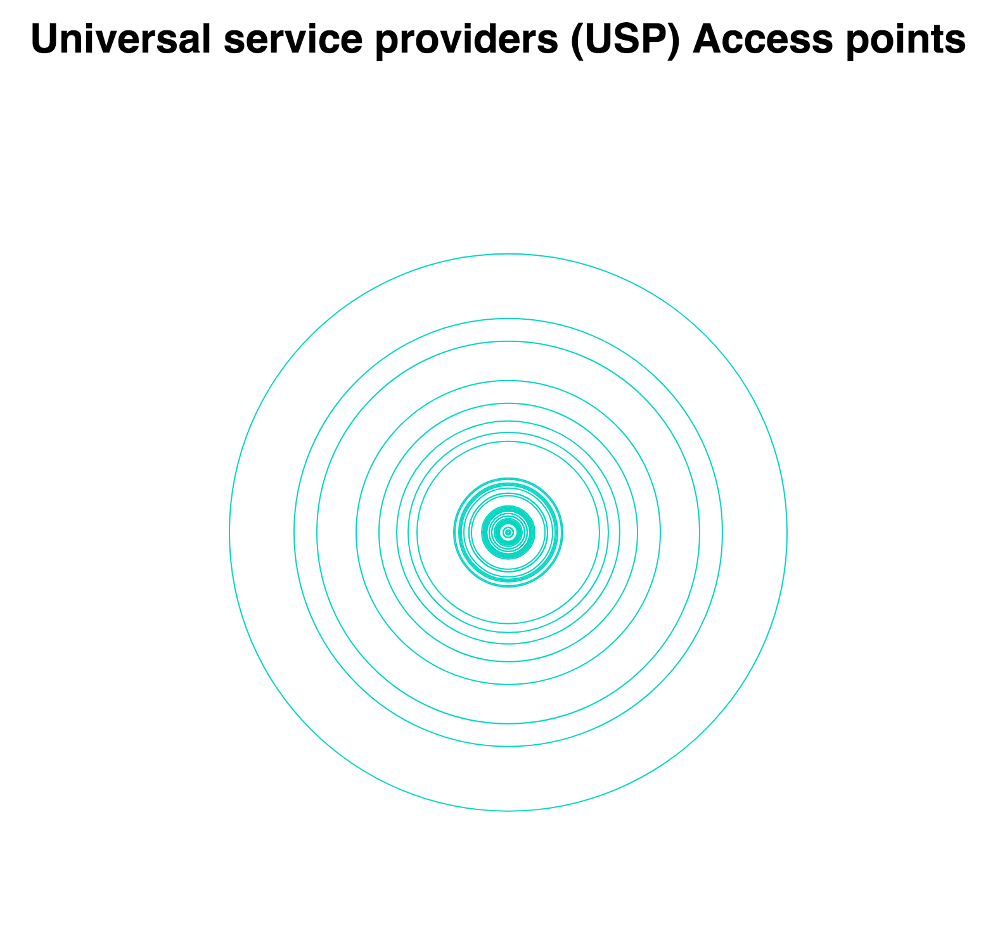

# !assignment-2 - UPS accesspoints.


## Background
It was time to start building my own designs instead of copying examples and edit those. I really do not like examples, they never do what I want them to do. In my opinion you never have full control over them until you edit them from top to bottom.




##  Data
For this assignment I use data from the UPS access points: Offices and postal agencies. In the file there were per country an amount of points indicated.

To clean this file I needed two methodes. 
One of them was slicing a character (backslash) from a columns:
``` javascript 
data = (data.slice(0, 17) + data.slice(18, data.length)); 
```

After that I only had to replace some characters. I found a usefull function that was able to replace all characters from a string:
``` javascript
data = replaceAll(data, ",", "\t");
```
> [replaceAll](https://stackoverflow.com/questions/1144783/how-to-replace-all-occurrences-of-a-string-in-javascript)

> Created by: Cory Gross

> Edited by: Peter Mortensen


Restructured data:
``` Javascript
{ years: [int year, int year], data: [columns : data, columns : data, yearData:{year : {value: int value}}], maxSizesPerYear: {year : int, year : int}, selectedYear: int year, width: int, height: int, lastCreatedTextGroupElement: html element }
```

## Features
* **replaceAll** https://stackoverflow.com/questions/1144783/how-to-replace-all-occurrences-of-a-string-in-javascript
* **fileExists]** https://stackoverflow.com/questions/15054182/javascript-check-if-file-exists
* **d3.scaleLinear()** https://github.com/d3/d3-scale#continuous-scales
* **domain** https://www.dashingd3js.com/d3js-scales
* **d3.max** https://github.com/d3/d3-3.x-api-reference/blob/master/Arrays.md
* **.rangeRound** https://github.com/d3/d3-scale#continuous_rangeRound
* **.on("click",** https://stackoverflow.com/questions/27499864/addeventlistener-to-div-appended-in-d3
* **d3.data** https://github.com/d3/d3-selection/blob/master/README.md#selection_data


## Licence

[Data source licence](https://ec.europa.eu/info/legal-notice_en)


